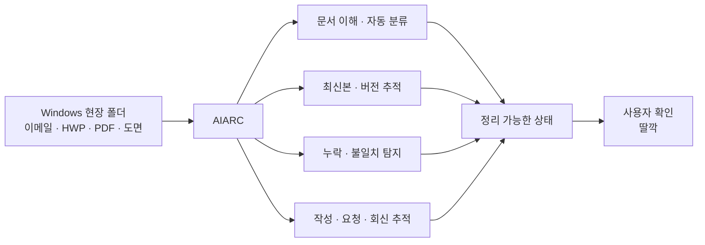

<p align="center">
  
</p>

<h1 align="center">AIARC</h1>

<p align="center">
  <strong>건설현장 폴더를 통째로 넣으면,<br/>AI가 문서를 정리하고 빠진 서류와 잘못된 최신본까지 찾아줍니다.</strong>
</p>

<p align="center">
  건설사의 Windows 폴더·이메일·HWP 위에서 작동하는<br/>
  <strong>local-first 건설 문서 AX 데스크톱 앱</strong>
</p>

<p align="center">
  
  
  
  
</p>

<p align="center">
  <a href="https://aiarc.kr">Landing Page</a> ·
  <a href="./docs/PRODUCT_SPEC.md">Product Spec</a> ·
  <a href="./docs/APP_DESIGN.md">App Design</a> ·
  <a href="./docs/ROADMAP.md">Roadmap</a>
</p>

---

## 30초 안에 이해하기

건설현장의 문서는 한 번 만들고 저장하면 끝나는 파일이 아닙니다.

공사 중 계속 **생성되고, 승인되고, 수정되고, 대체되고, 최종본으로 확정**됩니다. 그 사이 HWP, PDF, Excel, 도면, 사진, 이메일 첨부파일이 여러 폴더와 사람 사이를 오갑니다.

현재는 사람이 직접 기억하고 확인합니다.

- 이 문서가 어느 현장·자재·공종 것인지
- 지금 단계에서 필요한 서류인지
- 어떤 파일이 최신 승인본인지
- 변경된 도면이 최종 도면에 반영됐는지
- 무엇이 빠졌는지
- 무엇을 누구에게 다시 요청해야 하는지

AIARC는 이 반복 판단과 정리 작업을 하나의 흐름으로 묶는 것을 목표로 합니다.



> **목표 UX: 던진다 → AIARC가 알아서 판단한다 → 필요한 순간에만 사람이 확인한다.**

---

## 첫 번째 진입점: 준공 문서 자동정리

AIARC가 처음부터 건설업 전체를 자동화하려는 것은 아닙니다.

첫 번째 제품 경험은 가장 눈에 보이는 문제인 **준공 단계의 문서 정리와 누락 검토**에서 시작합니다.

```text
뒤섞인 현장 폴더 / ZIP
        ↓
      AIARC
        ↓
문서 인식 · 분류 · 관계 연결
        ↓
확보 / 누락 / 확인 필요 / 중복 / 최신본 후보
        ↓
       [전체 정리]
        ↓
정리된 문서 트리 + 검토할 예외만 표시
```

사용자가 파일 하나씩 열어서 `이게 무슨 서류인지`, `어디에 넣을지` 판단하게 만들지 않는 것이 핵심입니다.

---

## 하지만 본질은 '파일 정리'가 아닙니다

건설 문서는 **공사 단계에 따라 역할과 효력이 달라집니다.**

### 도면


같은 도면번호의 파일이 여러 개 있어도 `최근 수정일 = 현재 유효본`이라고 단순하게 볼 수 없습니다. 승인상태, revision, 변경근거와 실제 현장 반영 여부까지 연결되어야 합니다.

### 자재 문서


예를 들어 자재승인원은 자재 사용 전 승인단계에서는 중요하지만 일반적인 준공 제출세트와는 역할이 다릅니다. 따라서 AIARC는 단순히 `문서 종류`만 보는 것이 아니라 **공사 단계 + 현재 상태 + 버전 + 관계 + 제출 필요성**을 함께 다루는 방향으로 설계합니다.

내부 제품 정의는 다음과 같습니다.

> **AIARC = 건설 문서 생애주기 AX**

준공 자동정리는 그 전체 생애주기로 진입하는 첫 번째 제품 경험입니다.

[문서 생애주기 설계 자세히 보기 →](./docs/DOCUMENT_LIFECYCLE_AX.md)

---

## 제품이 지향하는 경험

AIARC는 범용 LLM 채팅앱이 아니라 **문서를 중심으로 AI와 함께 일하는 데스크톱 작업공간**입니다.

```text
┌──────────────────┬─────────────────────────────────────┐
│ AIARC            │                                     │
│                  │          DOCUMENT CANVAS            │
│ 현장             │                                     │
│ ▾ OOO 근린생활시설│          선택한 문서 / 근거          │
│                  │                                     │
│ 문서             │                                     │
│ ├ 자재           │            대화가 위로 갈수록       │
│ ├ 품질           │               자연스럽게 fade       │
│ ├ 감리           │                                     │
│ ├ 공사           │  AIARC: 47개 문서를 분석했습니다.  │
│ └ 준공           │  39 자동분류 · 누락 3 · 확인 2     │
│                  │                                     │
│ 확인 필요      2 │             [전체 정리]             │
│ 누락           3 │                                     │
│                  │  ┌───────────────────────────────┐  │
│ 신규 메일 2건   │  │ 파일을 드롭하거나 지시하기   │  │
│ 가져오기         │  └───────────────────────────────┘  │
└──────────────────┴─────────────────────────────────────┘
```

핵심 원칙:

- **One UI**: 본사/현장 직원을 별도 제품으로 나누지 않고 현재 현장만 선택
- **Unified Workspace Canvas**: Viewer와 Chat을 두 앱처럼 분리하지 않음
- **Automation first**: 정상 문서는 자동 처리하고 예외만 사람에게 표시
- **Evidence on demand**: AI 판단이 궁금할 때 원문 페이지와 근거를 바로 확인
- **Resizable workspace**: 사이드바와 대화 노출영역을 작업 방식에 맞게 조절
- **Existing workflow first**: Windows 폴더·이메일·HWP를 버리고 새 시스템에 재입력하게 하지 않음

[앱 UI/UX 설계 보기 →](./docs/APP_DESIGN.md)  
[Unified Workspace Canvas 설계 보기 →](./docs/APP_CANVAS_UX.md)

---

## AIARC가 기존 방식과 다른 지점

| 현재 업무 | AIARC가 지향하는 방식 |
|---|---|
| 파일을 하나씩 열어 문서 종류 판단 | 폴더·ZIP째 투입 후 자동 식별 |
| 사람이 폴더 위치 결정 | 현장·공종·자재·업무단계 자동 귀속 |
| 수정일·파일명으로 최신본 추정 | revision·승인·변경근거를 함께 추적 |
| 준공 직전에 다시 전수 확인 | 공사 중부터 제출 가능한 상태를 지속 관리 |
| 누락자료를 기억해서 다시 요청 | 누락 후보 탐지 → 요청 → 회신 → 최신본 연결 |
| PDF/HWP/Excel/도면/메일이 분리 | 하나의 Project Document Graph로 관계 연결 |
| AI와 문서를 하나씩 대화하며 분류 | 정상건은 자동 처리, 예외만 확인 |

AIARC의 목표는 ERP 전체를 대체하는 것이 아닙니다.

> **현재 도구들 사이에서 사람이 직접 기억하고, 비교하고, 옮기고, 추적하던 층을 AI 실행 레이어로 바꾸는 것**이 목표입니다.

---

## 현재 프로토타입

**Stage: Early prototype / validation**

현재는 완성형 제품을 주장하지 않습니다.

모두의 창업 제출 단계에서는 **실제 완성제품에 이어서 사용할 UI/UX를 먼저 만들고**, 내부의 AI·문서처리 엔진은 검증 순서에 따라 단계적으로 연결합니다.

### 현재 데모에서 보여주려는 vertical slice

```text
현장 선택
→ 현장 폴더 / ZIP 드롭
→ 분석 상태
→ 문서 자동분류 결과
→ 확보 / 누락 / 확인 필요 / 중복
→ [전체 정리]
→ 문서 트리 갱신
→ 누락 또는 불일치 클릭
→ 관련 문서를 Viewer에서 근거 확인
```

프로토타입에서 시뮬레이션되는 기능은 실제 구현 기능과 구분합니다.

### 지금부터 검증할 핵심 가설

| 가설 | 현재 상태 | 검증 방식 |
|---|---|---|
| 실제 현장자료에서 문서 종류를 의미 있게 분류할 수 있는가 | 검증 예정 | 실제 1차 정리 현장자료 benchmark |
| 공사 단계와 문서 역할을 구분할 수 있는가 | 검증 예정 | 사람의 실제 정리 결과와 비교 |
| 최신본·구버전 후보를 안전하게 찾을 수 있는가 | 검증 예정 | revision / 날짜 / 승인 근거 비교 |
| 누락 표시가 실제 업무시간을 줄이는가 | 검증 예정 | 실무자 Before / After 비교 |
| HWP·이메일·Windows 폴더를 하나의 흐름으로 연결할 가치가 있는가 | 현장 관찰 | 실제 사용자 인터뷰 및 Alpha |

검증 결과는 원본 현장자료를 공개하지 않고 방법·수치·한계를 [Evidence & Validation](./docs/EVIDENCE_AND_VALIDATION.md)에 기록합니다.

---

## 왜 한국부터 깊게 파는가

국내 건축·건설 실무에는 다음 요소가 한꺼번에 존재합니다.

- HWP 중심의 법정·기관·회사 서식
- Windows 중심의 사무환경
- 시공·감리·건축주·자재업체 사이의 이메일 왕복
- 승인·확인·날인과 반복되는 수정본
- 현장·발주처·기관마다 달라지는 제출체계
- PDF, Excel, 이미지, 도면 등 서로 다른 파일 형식

AIARC는 이 복잡성을 피하기 위해 사용자를 새 시스템으로 옮기지 않습니다. **기존 업무환경 위에서 실제 업무 흐름을 깊게 해결하는 것**을 먼저 선택합니다.

2026년 국토교통부·한국건설기술연구원 스마트건설지원센터의 건설기업 DX·AX 전환 수요조사에서도 AI를 활용한 문서 작성·검토 및 업무수행 지원이 AX 예시로 제시되었습니다. 이 사실을 구매수요의 증명으로 과장하지 않고, 현재 건설 AX가 정책적으로도 탐색되는 영역이라는 시기적 신호로만 사용합니다.

[확인된 근거와 미검증 가설 구분해서 보기 →](./docs/EVIDENCE_AND_VALIDATION.md)

---

## 제품 원칙

**UNDERSTAND → ORGANIZE → CREATE → ACT → TRACK**

- **Existing workflow first**: 같은 자료를 다시 입력하게 만들지 않음
- **Local-first**: 원본과 현장 인덱스는 가능한 한 사용자 PC·회사 저장소 중심
- **HWP-aware**: HWP를 부가 호환기능이 아니라 국내 핵심 업무환경으로 취급
- **Workflow, not chatbot**: 답변보다 다음 업무를 실제로 진행시키는 데 집중
- **Evidence before automation**: AI 판단과 원문 근거 연결
- **Human authority remains**: 법적·기술적 최종판단과 실제 날인·서명은 사람에게 유지
- **Start narrow, expand by workflow**: 하나의 실제 업무를 끝까지 검증한 뒤 확장

---

<details>
<summary><strong>장기 비전 · 20~30년 로드맵 보기</strong></summary>

<br/>

AIARC는 준공 정리 기능 하나에서 끝나는 제품을 목표로 하지 않습니다.

```text
준공서류 Prototype
→ 실제 현장자료 Validation
→ Usable Alpha
→ 품질관리서·자재증빙 Agent
→ Continuous Closeout Agent
→ 자재승인·검측
→ 설계변경·도면 Revision
→ Construction Document Graph
→ Multi-project / Team
→ Construction Backoffice AX
→ 국내 Architecture Document AX Platform
→ AIARC Core
→ 장기 국가별 Document / Workflow Pack
```

장기적으로 공통화하려는 문서 생애주기는 다음과 같습니다.

```text
수집
→ 이해
→ 관계 연결
→ 생성
→ 검토
→ 승인 / 변경
→ 전달
→ 회신 추적
→ 버전 관리
→ 최종 제출
```

글로벌 확장은 지금의 실행목표가 아닙니다. 국내에서 HWP, 법정서식, 문서관계, 이메일 회신, 버전·상태관리와 제출 업무를 충분히 해결한 뒤에만 검토합니다.

[전체 Roadmap 보기 →](./docs/ROADMAP.md)

</details>

---

## 더 깊게 보기

### 3분만 더 볼 경우

| 문서 | 무엇을 볼 수 있나 |
|---|---|
| [PRODUCT_SPEC.md](./docs/PRODUCT_SPEC.md) | 제품 정의, 사용자, 핵심 업무 흐름, 안전 경계 |
| [DOCUMENT_LIFECYCLE_AX.md](./docs/DOCUMENT_LIFECYCLE_AX.md) | 착공부터 준공까지 문서·도면의 상태와 생애주기 |
| [APP_DESIGN.md](./docs/APP_DESIGN.md) | 최종 데스크톱 앱 UI/UX와 AX interaction |
| [EVIDENCE_AND_VALIDATION.md](./docs/EVIDENCE_AND_VALIDATION.md) | 확인된 근거와 아직 검증하지 않은 가설의 구분 |

### 제품을 깊게 볼 경우

| 문서 | 역할 |
|---|---|
| [APP_CANVAS_UX.md](./docs/APP_CANVAS_UX.md) | Viewer와 Conversation이 결합된 Unified Workspace Canvas |
| [ROADMAP.md](./docs/ROADMAP.md) | 프로토타입부터 장기 플랫폼까지의 단계별 검증 계획 |
| [ORIGIN_AND_EVOLUTION.md](./docs/ORIGIN_AND_EVOLUTION.md) | 문제 발견에서 현재 제품 정의까지의 발전 과정 |

---

## Repository status

이 저장소는 현재 **제품 설계 + 초기 프로토타입 + 검증 준비 단계**입니다.

완성되지 않은 기능을 완성된 것처럼 표현하지 않습니다. 실제 기능, 데모 기능, 검증된 사실, 아직 검증되지 않은 가설을 가능한 한 구분해 기록합니다.

---

<p align="center">
  <strong>AIARC = AI + ARC</strong><br/>
  <sub>Architecture에서 출발해, 흩어진 건설 문서와 업무 단계를 하나의 흐름으로 연결합니다.</sub>
</p>
