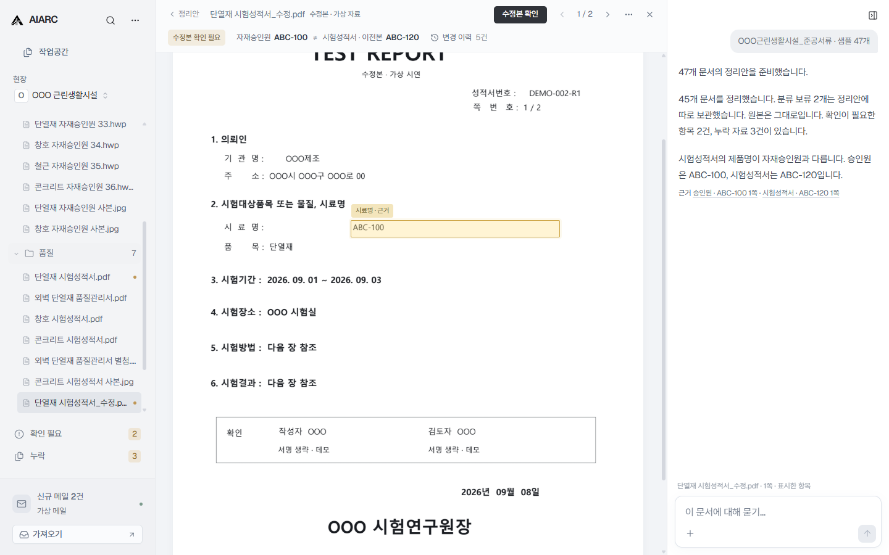

<p align="center">
  
</p>

<h1 align="center">AIARC</h1>

<p align="center">
  <strong>건축 프로젝트를 이해하는 AI 업무공간.</strong>
</p>

<p align="center">
  <sub><strong>준공 문서 자동화에서 시작해 프로젝트의 맥락을 파악하는 AI 업무공간으로, 더 나아가 건설 AI 업무 인프라로 확장합니다.</strong></sub>
</p>

<p align="center">
  
  
  
  
</p>

<p align="center">
  <a href="https://aiarc.kr/demo/"><strong>브라우저 데모</strong></a> ·
  <a href="https://aiarc.kr">제품 소개</a> ·
  <a href="./docs/PRODUCT_OVERVIEW.md">제품 개요</a> ·
  <a href="./docs/EVIDENCE.md">근거와 검증계획</a> ·
  <a href="./docs/PUBLIC_ROADMAP.md">로드맵</a>
</p>

---

## 30초 안에 이해하기

AIARC는 **문서·도면·메일·사진과 변경 기록을 연결해, 건축 프로젝트의 현재 상태와 다음에 할 일을 파악하도록 돕는 AI 업무공간**을 만들고 있습니다.

첫 적용 분야는 **공사를 마무리하는 준공 단계의 문서 업무**입니다. 창업자가 실무에서 반복했던 자료 취합·정리·누락 확인·보완 요청을 줄이는 Windows 데스크톱 앱으로 시작합니다.

준공은 프로젝트 전 과정에서 만들어진 많은 문서와 결과물이 모이는 단계입니다. AIARC는 준공 문서 업무에서 **문서의 종류·관계·최신본·누락을 이해하는 능력을 먼저 검증하고, 이를 프로젝트 전체의 맥락을 파악하는 AI 업무공간으로 확장합니다.**

AIARC는 어떤 자료가 최신인지, 무엇이 바뀌었는지, 아직 확인할 일이 무엇인지, 그 근거가 어디에 있는지를 함께 파악합니다.

<p align="center">
  <a href="https://aiarc.kr/demo/">
    
  </a>
</p>
<p align="center"><sub>문서와 근거가 연결되는 AIARC 작업공간 · 이미지를 누르면 브라우저 데모로 이동합니다.</sub></p>

**현재 공개된 앱은 가상 자료로 제품 흐름을 체험하는 프로토타입입니다.** 파일 정보 확인과 문서 열기는 실제로 동작하지만, 분류·누락 분석·보완 요청·회신은 준비된 데모 데이터로 시연합니다. 실제 AI 분석이나 메일 송수신 기능이 완성된 서비스는 아닙니다.

---

## 현재 제품: 준공 문서 자동화

현재 프로토타입은 여러 곳에서 받은 준공 자료를 정리하고, 누락되거나 내용이 맞지 않아 사람이 확인해야 할 항목을 보여줍니다. 아래 흐름의 분석 결과는 준비된 샘플을 사용합니다.

```text
PC에 저장된 현장자료 폴더 / ZIP
        ↓
      AIARC
        ↓
문서 인식 · 분류 · 관계 연결
        ↓
누락 / 확인 필요 / 중복 / 최신본 후보
        ↓
정리된 결과 + 확인할 항목
```

현재 제품의 목표는 단순합니다.

> **사람이 모든 파일을 처음부터 다시 열어보지 않아도, 정리된 결과와 확인할 항목부터 볼 수 있게 하는 것.**

초기 제품은 회사 전체의 시스템 교체나 여러 참여자의 동시 도입을 전제로 하지 않습니다. 기존처럼 **이메일로 개별 파일이나 ZIP을 주고받고 PC의 현장별 폴더에 저장·관리하는 업무환경을 바꾸지 않아도**, 사용자 한 명이 먼저 문서 업무를 줄일 수 있어야 합니다.

AIARC는 **자동화가 먼저 일하고, 사용자는 필요한 순간에만 확인하는 Windows 데스크톱 작업공간**을 지향합니다.

- AI 판단은 가능한 한 원문 근거와 연결합니다.
- 법적·기술적 최종 판단과 날인·서명은 사람이 합니다.
- 원본 파일은 보존하고 자동화 결과는 되돌릴 수 있어야 합니다.

**[브라우저에서 직접 시연하기 →](https://aiarc.kr/demo/)**

---

## 왜 이 문제인가

준공부터 시작하는 이유도 분명합니다. 준공 단계에는 설계·시공·감리·자재·품질 등 프로젝트 전 과정의 결과물이 모입니다. AIARC는 이 지점에서 먼저 **실제 프로젝트 자료의 종류·관계·최신본·누락·변경 반영 여부를 이해할 수 있는지** 검증합니다.

준공 단계에서는 자료를 한 번 받았다고 일이 끝나지 않습니다.

```text
자료 확인
→ 누락 확인
→ 보완 요청
→ 수정·보완본 수신
→ 최신본 반영
→ 최종 제출용 서류 세트 완성
```

AIARC가 줄이려는 것은 전문가의 검토나 책임이 아니라, 그 사이에서 반복되는 **찾기·정리·대조·누락 확인·보완 요청·수정본 반영·추적**입니다.

현행 「건축법」과 하위법령에는 감리, 건축자재 품질관리, 사용승인 과정에서 문서와 도서를 작성·기록·확인·전달·첨부·제출하는 절차가 존재합니다. 착공·준공·감리 관련 문서업무를 유료로 대행하는 공개 서비스도 존재합니다.

AIARC는 창업자가 건축사사무소에서 건축사보로 근무하며 감리·사용승인 업무에 참여한 경험에서 출발했습니다. 자료 확인, 누락 자료 요청, 수정·보완본 반영을 반복하며 겪은 어려움을 첫 제품의 문제로 삼았습니다.

[법·제도·시장 근거 보기 →](./docs/EVIDENCE.md)

---

## 프로젝트를 이해하는 AI 업무공간

준공 단계에서 문서 이해와 관계 연결 능력을 검증한 뒤, 이를 공사가 진행되는 동안에도 활용하는 **AI 업무공간**으로 발전시키려 합니다. 자료가 들어올 때마다 관련 문서와 변경 기록을 연결해 프로젝트의 현재 상태를 파악하는 것이 목표입니다.

사용자는 이 업무공간에서 다음 질문에 답을 얻을 수 있어야 합니다.

> **“지금 어떤 자료를 기준으로 봐야 해?”**<br>
> **“왜 이렇게 바뀌었어?”**<br>
> **“관련 근거는 어디 있어?”**<br>
> **“다음으로 무엇을 확인해야 해?”**

일반적인 저장·협업 도구가 파일을 모으고 공유하고 찾는 데 집중한다면, AIARC는 **자료와 변경 기록을 연결해 현재 유효한 내용과 아직 확인이 필요한 일을 파악하는 것**을 차별화 지점으로 둡니다.

프로젝트의 현재 상태와 변경 흐름을 이해하는 방식에 대한 상세 사례와 제품 원리는 [제품 개요](./docs/PRODUCT_OVERVIEW.md)에서 설명합니다.

---

## 어디까지 가는가

제품의 발전과 사업의 확장은 서로 다른 축입니다.

```text
제품 · 기술
준공 문서 자동화
→ 프로젝트를 이해하는 AI 업무공간
→ Project Intelligence
→ Architecture / Construction Agent

핵심 능력
프로젝트의 현재 상태 · 변경 · 확인이 필요한 일 · 근거를 지속적으로 파악하고 활용

장기 목표
Architecture AI
```

Project Intelligence는 프로젝트 상태를 바탕으로 위험·충돌·누락을 파악하는 단계이고, Architecture / Construction Agent는 그 판단에 따라 필요한 도구로 업무를 수행하는 단계입니다.

**Architecture AI는 건축 프로젝트에 필요한 더 넓은 지식 업무를 수행하는 AI라는 장기 목표입니다.** 위 단계는 앞으로의 발전 방향이며, 현재 구현된 기능 목록이 아닙니다.

### 준공 문서 자동화에서 건설 업무의 연결점으로

한 사람의 문서 업무에서 시작해, 프로젝트 참여자와 회사 사이의 자료 전달·보완 요청 업무로 사용 범위를 넓혀가려 합니다.

```text
한 사람의 업무 → 한 프로젝트 → 프로젝트 참여자 → 회사
→ 회사와 회사 사이의 업무 → 건설 업무 네트워크 → 건설 AI 업무 인프라
```

기존 외부 업무와 행정 시스템을 대체하려는 것이 아닙니다. **AIARC 안에서 정리한 자료와 진행한 업무가 기존 외부 업무·행정 시스템과 자연스럽게 이어지는 AI 업무공간**을 지향합니다.

상세 단계와 검증 원칙은 [공개 로드맵](./docs/PUBLIC_ROADMAP.md)에서 확인할 수 있습니다.

---

## 이 저장소에서 볼 수 있는 것

이 저장소는 AIARC의 **공개 아이디어·비전·제품 시연 저장소**입니다.

해결하려는 문제, 데모로 체험할 수 있는 제품 흐름, 근거 자료와 앞으로의 발전 방향을 공개합니다. 상세 제품 사양과 데이터 모델, 평가 기준, 사업화 전략 및 앱 개발 소스는 비공개 저장소에서 관리합니다.

<p align="center">
  <strong>AIARC = AI + ARC</strong><br/>
  <sub>Architecture에서 출발해, 프로젝트의 흩어진 자료와 업무 흐름을 현재 상태와 다음 행동으로 연결합니다.</sub>
</p>
