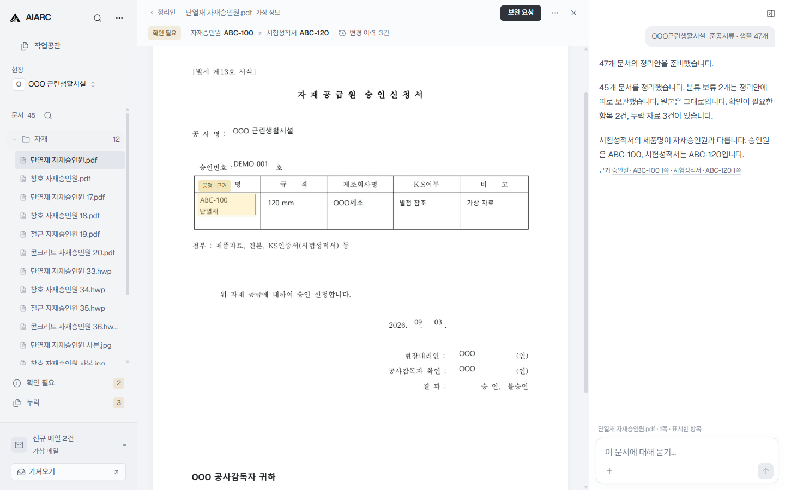

<p align="center">
  
</p>

<h1 align="center">AIARC</h1>

<p align="center">
  <strong>공사가 끝나도,<br/>서류는 끝나지 않습니다.</strong>
</p>

<p align="center">
  <sub><strong>현재: 준공 문서 자동화</strong> · <strong>다음: AI Project Workspace</strong> · <strong>핵심: Project State</strong> · <strong>확장: 건설 AI 업무 인프라</strong></sub>
</p>

<p align="center">
  
  
  
  
</p>

<p align="center">
  <a href="https://aiarc.kr/demo/"><strong>Live Demo</strong></a> ·
  <a href="https://aiarc.kr">Landing Page</a> ·
  <a href="./docs/PRODUCT_OVERVIEW.md">Product Overview</a> ·
  <a href="./docs/EVIDENCE.md">Evidence</a> ·
  <a href="./docs/PUBLIC_ROADMAP.md">Roadmap</a>
</p>

---

## 30초 안에 이해하기

AIARC는 **준공 단계에서 반복되는 문서 취합·정리·누락 확인·보완 업무를 줄이는 Windows 데스크톱 AI 앱**에서 시작합니다.

하지만 최종 제품은 준공 문서 정리도구가 아닙니다.

> **프로젝트의 문서·도면·메일·사진과 변경 흔적을 한 프로젝트 맥락으로 연결하고, AI가 지금 무엇이 유효하고 왜 바뀌었으며 무엇을 해야 하는지 이해하는 건축·건설 AI Project Workspace를 지향합니다.**

AIARC의 각 개념은 서로 다른 역할을 가집니다.

```text
진입점        준공 문서 자동화
제품          AI Project Workspace
핵심 능력     Project State
사업 확장     건설 AI 업무 인프라
장기 North Star  Architecture AI
```

**Project State는 Workspace 다음에 등장하는 별도 제품 단계가 아닙니다.** 프로젝트의 현재 상태·변경·미결사항·근거를 지속적으로 이해하고 다음 업무로 이어가기 위해 제품 전반을 관통하는 핵심 능력입니다.

준공부터 시작하는 이유도 분명합니다. 준공 단계에는 설계·시공·감리·자재·품질 등 프로젝트 전 과정의 결과물이 모입니다. AIARC는 이 지점에서 먼저 **실제 프로젝트 자료의 종류·관계·최신본·누락·변경 반영 여부를 이해할 수 있는지** 검증합니다.

<p align="center">
  <a href="https://aiarc.kr/demo/">
    
  </a>
</p>
<p align="center"><sub>문서와 근거가 연결되는 AIARC 작업공간 · 이미지를 누르면 Live Demo로 이동합니다.</sub></p>

---

## 왜 이 문제인가

준공 단계에서는 자료를 한 번 받았다고 일이 끝나지 않습니다.

```text
자료 확인
→ 누락 확인
→ 보완 요청
→ 수정·보완본 수신
→ 최신본 반영
→ 최종 제출용 서류 세트 완성
```

AIARC가 줄이려는 것은 전문가의 검토나 책임이 아니라, 그 사이에서 반복되는 **찾기·정리·대조·누락 확인·보완 요청·수정본 반영·추적**입니다.

이 문제는 단순한 파일정리 습관도 아닙니다. 현행 「건축법」과 하위법령에는 감리, 건축자재 품질관리, 사용승인 과정에서 문서와 도서를 작성·기록·확인·전달·첨부·제출하는 절차가 존재합니다. 착공·준공·감리 관련 문서업무를 유료로 대행하는 공개 서비스도 존재합니다.

AIARC는 건축사사무소에서 건축사보로 근무하며 감리·사용승인 업무에 참여하는 과정에서 출발했습니다. 전달받은 자료를 확인하고, 빠진 자료를 요청하고, 수정·보완본과 최신본을 반영하는 작업을 직접 수행한 경험이 첫 제품의 출발점입니다.

[법·제도·시장 근거 보기 →](./docs/EVIDENCE.md)

---

## 현재 제품: 준공 문서 자동화

현재 0.6.0 프로토타입은 준공 단계에 이미 흩어진 자료를 정리하고, 사람이 확인해야 할 예외를 먼저 보여주는 제품 경험을 시연합니다.

```text
현장 폴더 / ZIP
        ↓
      AIARC
        ↓
문서 인식 · 분류 · 관계 연결
        ↓
누락 / 확인 필요 / 중복 / 최신본 후보
        ↓
정리된 결과 + 검토할 예외
```

현재 제품의 목표는 단순합니다.

> **사람이 모든 파일을 처음부터 다시 열어보지 않아도, 정리된 결과와 확인할 예외부터 볼 수 있게 하는 것.**

초기 제품은 회사 전체의 시스템 교체나 여러 참여자의 동시 도입을 전제로 하지 않습니다. 기존 폴더·ZIP·이메일 환경 위에서 **사용자 한 명이 먼저 가치를 얻을 수 있어야 합니다.**

**[브라우저에서 직접 시연하기 →](https://aiarc.kr/demo/)**

---

## 다음 제품: AI Project Workspace

준공에서 검증한 문서 이해와 관계 연결 능력을 공사 중으로 앞당기면, 프로젝트 자료가 생길 때부터 같은 맥락으로 연결되는 **AI Project Workspace**가 됩니다.

```text
문서 · 도면 · 메일 · 사진 · 변경 기록
                ↓
문서 자동 정리와 관계 파악
                ↓
현재 상태 · 변경 · 미결사항 · 근거
        Project State가 지속적으로 구축됨
                ↓
검색 · 질문 · 설명 · 다음 업무
```

Project State의 목적은 영어 개념을 사용자에게 학습시키는 것이 아닙니다. 사용자는 결국 다음 질문에 답을 얻으면 됩니다.

> **“지금 무엇이 맞아?”**  
> **“왜 이렇게 바뀌었어?”**  
> **“관련 근거는 어디 있어?”**  
> **“지금 다음으로 뭘 해야 해?”**

일반적인 저장·협업 도구가 파일을 모으고 공유하고 찾는 데 집중한다면, AIARC는 **파일과 업무 흔적의 관계를 이해하고 현재 무엇이 유효하고 무엇이 미결인지 파악하는 것**을 차별화 지점으로 둡니다.

Project State의 상세 사례와 제품 원리는 [Product Overview](./docs/PRODUCT_OVERVIEW.md)에서 설명합니다.

---

## 준공 문서에서, 건설 업무의 연결점으로

AIARC의 확장은 모든 회사를 한 번에 새로운 플랫폼으로 옮기는 데서 시작하지 않습니다.

```text
한 사람의 업무
↓
한 프로젝트
↓
프로젝트 참여자
↓
회사
↓
회사와 회사 사이의 업무
↓
건설 업무 네트워크
↓
건설 AI 업무 인프라
```

현재 건설 업무에서는 사람과 기업이 폴더, 이메일, HWP, PDF, Excel, 전화와 여러 외부 시스템을 오갑니다. AIARC는 이 도구들을 모두 대체하려는 것이 아니라, **그 사이에 흩어진 프로젝트 자료와 업무의 맥락을 연결하는 방향**으로 확장합니다.

```text
사람 · 기업
     ↕
   AIARC
문서 · 상태 · 변경 · 업무를 연결
     ↕
프로젝트 참여자
     ↕
기존 외부 업무 · 행정 시스템과 연결
```

감리·발주·인허가·사용승인 등 기존 제도와 시스템을 대체한다는 뜻이 아닙니다. **AIARC 안에서 정리되고 진행된 프로젝트 업무가 기존 외부 업무와 자연스럽게 이어지는 앞단의 AI 업무공간**을 지향합니다.

> **AIARC의 장기 사업적 위치는 또 하나의 문서관리 프로그램이 아니라, 사람과 기업 사이에 흩어진 건설 업무를 연결하는 AI 업무 인프라입니다.**

---

## 제품 경험과 현재 단계

AIARC는 범용 챗봇보다 **자동화가 먼저 일하고 사용자는 필요한 순간에만 확인하는 Windows 데스크톱 작업공간**을 지향합니다.

```text
파일 / 폴더 / ZIP 투입
→ AIARC 자동 분석
→ 문제가 없는 문서는 자동 처리
→ 누락 · 충돌 · 애매한 판단만 표시
→ 사용자는 필요한 순간에만 원문 근거 확인
```

**Stage: Prototype / validation**

현재 0.6.0은 준공 문서 자동화의 제품 경험과 Project State에 필요한 첫 능력인 **프로젝트 문서 이해·분류·관계 연결**을 검증하는 단계입니다. AI Project Workspace 전체와 실제 AI·메일·백엔드가 완성됐다는 뜻은 아니며, 시뮬레이션되는 기능과 실제 구현 범위를 구분해 공개합니다.

- 기존 Windows 폴더·이메일·HWP 중심 환경을 존중합니다.
- AI 판단은 가능한 한 원문 근거와 연결합니다.
- 법적·기술적 최종 판단과 날인·서명은 사람이 합니다.
- 원본 파일은 보존하고 자동화 결과는 되돌릴 수 있어야 합니다.

[공개 근거와 검증계획 →](./docs/EVIDENCE.md)

---

## 어디까지 가는가

제품의 발전과 사업의 확장은 서로 다른 축입니다.

```text
제품 · 기술
준공 문서 자동화
→ AI Project Workspace
→ Project Intelligence
→ Architecture / Construction Agent

핵심 능력
Project State
└ 프로젝트의 현재 상태 · 변경 · 미결사항 · 근거를 지속적으로 구축하고 활용

사업 · 사용 범위
한 사람의 업무
→ 한 프로젝트
→ 프로젝트 참여자
→ 회사와 회사 사이의 업무
→ 건설 업무 네트워크
→ 건설 AI 업무 인프라

장기 North Star
Architecture AI
```

**준공 자동화는 진입점, AI Project Workspace는 제품, Project State는 핵심 능력, 건설 AI 업무 인프라는 사업이 차지하려는 위치, Architecture AI는 장기 North Star입니다.**

상세 단계와 검증 원칙은 [Public Roadmap](./docs/PUBLIC_ROADMAP.md)에서 확인할 수 있습니다.

---

## Repository status

이 저장소는 AIARC의 **공개 아이디어·비전·제품 시연 저장소**입니다.

공개 범위는 문제, 제품 경험, 검증 근거와 고수준 로드맵입니다. 상세 제품 사양, 데이터 모델, 평가체계, 사업화 전략, 내부 R&D와 실제 개발 정본은 비공개 저장소에서 관리합니다.

<p align="center">
  <strong>AIARC = AI + ARC</strong><br/>
  <sub>Architecture에서 출발해, 프로젝트의 흩어진 자료와 업무 흐름을 현재 상태와 다음 행동으로 연결합니다.</sub>
</p>